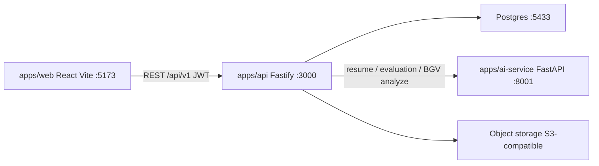
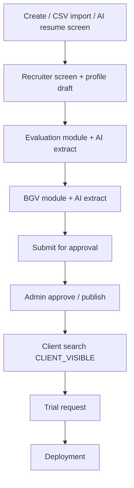
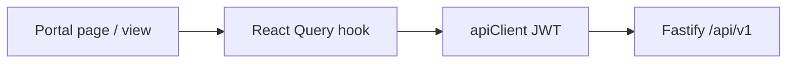

# BesTal Architecture

Current system architecture and data flows for the BesTal monorepo as implemented in this repository.

## 1. System overview

BesTal is a multi-tenant recruiting SaaS: a marketing website and role-based portals in one React app, a Fastify REST API, a FastAPI AI microservice, and PostgreSQL. Shared UI and utilities live in npm workspace packages.



npm workspaces (`package.json`): `apps/*`, `packages/*`.

| Command | Purpose |
|---------|---------|
| `npm run dev:web` | Vite web app |
| `npm run dev:api` / `npm run dev -w @bestal/api` | Fastify API |
| `npm run dev:ai` / `docker compose up ai-service` | AI service |
| `docker compose up -d postgres` | Local database |

---

## 2. Apps and packages

| Layer | Path | Role |
|-------|------|------|
| Web | [`apps/web`](../apps/web) | Public site + Super Admin, Admin, Recruiter, Sales, Client portals. React Query hooks call [`apps/web/src/lib/api`](../apps/web/src/lib/api). |
| API | [`apps/api`](../apps/api) | Fastify domain modules under [`apps/api/src/modules`](../apps/api/src/modules). Prisma schema/migrations in [`apps/api/prisma`](../apps/api/prisma). |
| AI | [`apps/ai-service`](../apps/ai-service) | FastAPI process for resume, evaluation, and BGV analysis. See [`apps/ai-service/README.md`](../apps/ai-service/README.md). |
| UI | [`packages/ui`](../packages/ui) | Shared components, dashboard/marketing layouts, Tailwind design tokens (teal brand palette). |
| Utils | [`packages/shared-utils`](../packages/shared-utils) | `cn()`, formatters, candidate status labels, import contract. |
| Mock | [`packages/mock-data`](../packages/mock-data) | Demo/fallback data used by some client UX surfaces. |

### Entry points

| Service | Entry | Framework |
|---------|-------|-----------|
| Web | `apps/web/src/main.tsx`, router `apps/web/src/app/router.tsx` | React 19 + Vite |
| API | `apps/api/src/main.ts` → `buildApp()` in `apps/api/src/app.ts` | Fastify |
| AI | `apps/ai-service` (`uvicorn app.main:app`) | FastAPI |

---

## 3. Runtime and infrastructure

From [`docker-compose.yml`](../docker-compose.yml):

| Service | Host port | Notes |
|---------|-----------|-------|
| Postgres | **5433** → 5432 | DB `bestal`, user/password `bestal` |
| AI service | **8001** → 8000 | Single process for resume / evaluation / BGV routes |
| API | **3000** (typical local) | Swagger UI at `/docs` |
| Web | **5173** | Proxies `/api/v1` to the API |

Web API client ([`apps/web/src/lib/api/client.ts`](../apps/web/src/lib/api/client.ts)):

- Base URL: `VITE_API_BASE_URL` or relative `/api/v1`
- JWT access token + refresh flow on `401`

API → AI env vars (see AI README):

```env
AI_EXTRACTION_URL=http://localhost:8001/api/v1/ai/resume/analyze
AI_EVALUATION_URL=http://localhost:8001/api/v1/ai/evaluation/analyze
AI_BGV_URL=http://localhost:8001/api/v1/ai/background/analyze
```

AI HTTP endpoints:

| Endpoint | Purpose |
|----------|---------|
| `POST /api/v1/ai/resume/analyze` | Resume extraction / AI screening |
| `POST /api/v1/ai/evaluation/analyze` | Evaluation document analysis |
| `POST /api/v1/ai/background/analyze` | BGV report analysis |
| `GET /health` | Health check |

API boot also starts:

- Orphaned candidate-import batch reclaim (`CandidateImportService`)
- System roles seed check (`AdminRolesService`)
- Lifecycle scheduler (deployments / trials / reminders) — `LifecycleSchedulerService` in `apps/api/src/main.ts`

---

## 4. Portals and auth

Route prefixes are defined in [`apps/web/src/app/router.tsx`](../apps/web/src/app/router.tsx).

| Portal | Prefix | Primary concerns |
|--------|--------|------------------|
| Public | `/` | Marketing: home, how it works, talent, jobs, communities, enterprise, about, contact |
| Portal picker | `/login` | Choose Super Admin / Admin / Recruiter / Sales / Client login |
| Super Admin | `/super-admin/*` | Users, roles/permissions, clients, candidates, reports, audit, platform settings, data import |
| Admin | `/admin/*` | Candidates, pending approvals, clients, trials, deployments, evaluations, BGV |
| Recruiter | `/recruiter/*` | Candidate create/import/edit, pipeline actions, evaluations, BGV, clients, trials, deployments |
| Sales | `/sales/*` | Clients, candidates, trials, deployments, margin |
| Client | `/client/*` | Dashboard, candidate search, profile, trials, deployments |

### Auth and RBAC

- Module: [`apps/api/src/modules/auth`](../apps/api/src/modules/auth)
- JWT access + refresh tokens; password reset tokens
- Permissions: [`auth.permissions.ts`](../apps/api/src/modules/auth/auth.permissions.ts)
- Roles stored as `PlatformRole` (Prisma); memberships tie users to organizations (and clients for CLIENT users)
- Web shells gate routes with portal-specific protected layouts and permission hooks

---

## 5. API domain modules

Registered under `/api/v1` via [`apps/api/src/routes/index.ts`](../apps/api/src/routes/index.ts).

| Module | Path | Responsibility |
|--------|------|----------------|
| Auth | `modules/auth` | Login, refresh, password reset, session user |
| Users | `modules/users` | User invite/list (org-scoped ops) |
| Admin | `modules/admin` | Dashboard metrics, platform roles, audit helpers |
| Candidates | `modules/candidates` | CRUD, assets, pipeline actions, CSV import |
| Evaluations | `modules/evaluations` | Evaluation records, AI extract, candidate scores |
| Background checks | `modules/background-checks` | BGV workflow, AI extract, review |
| Clients | `modules/clients` | Client accounts |
| Shortlists | `modules/shortlists` | Client shortlists |
| Trials | `modules/trials` | Trial requests and outcomes |
| Deployments | `modules/deployments` | Placements, extensions |
| Search | `modules/search` | Talent search endpoints |
| Skill communities | `modules/skill-communities` | Skill taxonomy |
| Notifications | `modules/notifications` | In-app notifications |

### Typical layering

```text
routes → controller → service → repository → Prisma
                 ↘ mapper / validator
```

Shared plugins (config, Prisma, JWT, multipart, Swagger, security) are registered in [`apps/api/src/app.ts`](../apps/api/src/app.ts).

Storage and AI HTTP clients live under `apps/api/src/services/` (e.g. S3, evaluation extraction, BGV extraction, resume extraction).

---

## 6. Data model (Prisma)

Schema: [`apps/api/prisma/schema.prisma`](../apps/api/prisma/schema.prisma).

### Tenancy and identity

| Model | Role |
|-------|------|
| `Organization` | Tenant |
| `User` | Platform user |
| `Membership` | User ↔ organization (role, optional client link) |
| `PlatformRole` | Role codes, portal, permission JSON |
| `RefreshToken` / `PasswordResetToken` | Auth tokens |
| `Client` | Hiring company account |

### Talent core

| Model | Role |
|-------|------|
| `SkillCommunity` | Skill / community taxonomy |
| `Candidate` | Profile, pipeline statuses, rates, scores |
| `CandidateSkill` | Skills on a candidate |
| `Document` | Resume, profile image, intro video, BGV/eval files (S3 keys) |
| `Evaluation` | Technical evaluation scores and summaries |
| `BackgroundCheck` | BGV status, check dimensions, AI summary |
| `CandidateScore` | Aggregated score rollups |

### Commercial engagement

| Model | Role |
|-------|------|
| `Shortlist` / `ShortlistCandidate` | Client shortlists |
| `TrialRequest` | Free-trial / trial engagement |
| `Deployment` | Active / completed placement |

### Platform ops

| Model | Role |
|-------|------|
| `CandidateImportBatch` / `CandidateImportRow` / `CandidateImportError` | Async CSV import |
| `OorwinImportBatch` / `OorwinImportRow` | External import batches |
| `Notification` | User notifications |
| `AuditLog` | Audit trail |
| `SystemSetting` | Platform settings |

### Candidate status fields (high level)

Pipeline gates use enums on `Candidate` (see [`candidate-pipeline.ts`](../apps/api/src/modules/candidates/candidate-pipeline.ts) and shared labels in `@bestal/shared-utils`):

| Field | Meaning |
|-------|---------|
| `profileStatus` | Pipeline stage (e.g. `SOURCED` → … → `CLIENT_VISIBLE`) |
| `approvalStatus` | Admin approval (`PENDING`, `APPROVED`, `REJECTED`, …) |
| `visibility` | e.g. `INTERNAL_ONLY` vs `CLIENT_VISIBLE` |
| `evaluationStatus` | Evaluation lifecycle |
| `bgvStatus` | Background check lifecycle |

---

## 7. End-to-end candidate data flow



### Narrative

1. **Create / import / AI screen**  
   Recruiter or admin creates a candidate (wizard) or uploads a CSV import batch. Resume upload can trigger AI resume analysis (`AI_EXTRACTION_URL`). Import batches are processed asynchronously; orphaned batches are reclaimed on API start.

2. **Recruiter screen + profile draft**  
   Recruiter completes review, skills, pricing, and availability. Profile moves through early `profileStatus` values (`AI_SCREENED`, `RECRUITER_SCREENED`, … toward `PROFILE_DRAFT`).

3. **Evaluation**  
   Evaluation module stores scores/recommendations. Uploaded evaluation documents can be sent to the AI service (`AI_EVALUATION_URL`). Candidate `evaluationStatus` / `profileStatus` advance per pipeline rules.

4. **BGV**  
   Background-check module manages consent, report upload, review. Report AI extract uses `AI_BGV_URL`. Clear/complete BGV unlocks later pipeline steps.

5. **Submit for approval**  
   When the profile is draft-ready, recruiter submits for admin approval (`submittedForApprovalAt`, approval pending).

6. **Admin approve / publish**  
   Admin approves (and publishes) so the candidate becomes client-visible (`approvalStatus`, `visibility`, `profileStatus` → client-facing stage). Approve/publish actions are admin-owned (not recruiter pipeline buttons).

7. **Client search**  
   Client portal lists candidates the org may see (`CLIENT_VISIBLE` / approved). List DTOs include fields such as `profileImageUrl` for cards; UI maps via [`client-search-api.ts`](../apps/web/src/lib/client-search-api.ts).

8. **Trial → deployment**  
   Client (or sales) requests a trial; ops manage trial outcome. Successful engagement becomes a `Deployment`. Lifecycle scheduler handles reminders / extensions / expiry-related jobs.

Documents (resume, photo, reports) are stored via the API storage service (S3-compatible); URLs are resolved when mapping DTOs.

---

## 8. Frontend data flow pattern



- **Pages** under `apps/web/src/pages/{public,admin,recruiter,sales,client,super-admin}`
- **Shared views** under `apps/web/src/components/...` (listings, import, evaluations, BGV, client cards)
- **Hooks** under `apps/web/src/hooks/api` wrap REST resources
- **Shells** (`AdminShell`, `ClientShell`, …) use `@bestal/ui` `DashboardLayout` (white sidebar, brand teal tokens)
- **Design tokens** live in `packages/ui` (`globals.css`, Tailwind preset) and are consumed by the web app via `@bestal/ui/globals.css`

### Client search photo path

```text
API list item.profileImageUrl
  → mapApiCandidateToClientSearchRecord().photoUrl
  → ToptalCandidateCard / ClientCandidateCard photo panel
```

---

## 9. Related docs

| Doc | Content |
|-----|---------|
| [`README.md`](../README.md) | Quick start, portals, demo credentials |
| [`apps/ai-service/README.md`](../apps/ai-service/README.md) | AI service endpoints and env |
| API Swagger | `http://localhost:3000/docs` when API is running |
