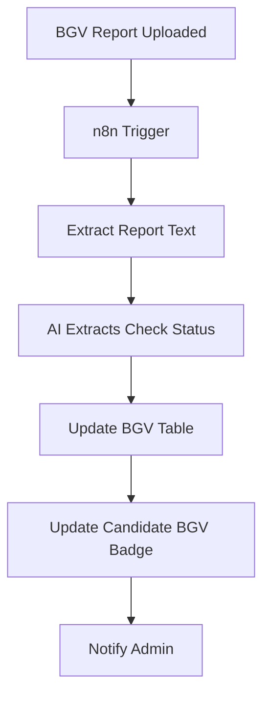

# BESTAL_BGV_AI_ANALYSIS

n8n orchestration for BesTal BGV AI Analysis.

| Field | Value |
|-------|--------|
| **Workflow name** | `BESTAL_BGV_AI_ANALYSIS` |
| **Workflow version** | `1.0.0` |
| **Job type** | `BGV_ANALYSIS` |
| **Trigger path** | `/webhook/bestal-bgv-analysis` (`N8N_BGV_WORKFLOW_PATH`) |
| **Import file** | [`BESTAL_BGV_AI_ANALYSIS.json`](./BESTAL_BGV_AI_ANALYSIS.json) |

## End-to-end flow



Fastify triggers n8n when a final BGV report is uploaded (or via `extract-bgv` / `extract-ai`). The internal callback persists AI results, syncs the candidate `bgvStatus` / `profileStatus`, and notifies admins.

## Sequence

```text
Webhook → Validate Request → Input Valid? → Respond Trigger Accepted (immediate HTTP 200)
→ Extract Input → Download BGV From Signed URL
→ Extract BGV Text → Prepare AI Prompt → OpenAI → Validate Structured JSON
→ Normalize Result → Prepare Callback Payload → Call Fastify Internal Callback
→ Handle Success (no-op) / Handle Failure
```

## Trigger HTTP response (immediate)

After validation, **Respond Trigger Accepted** returns `{ ok: true, accepted: true, jobId, status: "PROCESSING" }` within ~1–2s. Full analysis completion is only via the internal callback.

---

## Input (Fastify → n8n)

```json
{
  "jobId": 126,
  "candidateId": 1001,
  "documentId": 503,
  "documentUrl": "https://…signed-url…",
  "requestedBy": 25
}
```

## Success callback

`POST {BESTAL_API_BASE_URL}/internal/automation/callbacks/bgv-analysis`

```json
{
  "jobId": 126,
  "candidateId": 1001,
  "status": "COMPLETED",
  "result": {
    "overallStatus": "CLEAR",
    "idCheckStatus": "CLEAR",
    "addressCheckStatus": "CLEAR",
    "employmentCheckStatus": "CLEAR",
    "educationCheckStatus": "CLEAR",
    "criminalCheckStatus": "CLEAR",
    "referenceCheckStatus": "CLEAR",
    "concernNotes": "",
    "aiBgvSummary": "…"
  }
}
```

Never include raw report text in `result`.

## Environment

Configure workflow URLs in **Super Admin → Platform Settings → Automation**. Keep `AUTOMATION_CALLBACK_SECRET` in Fastify env. n8n also needs `BESTAL_API_BASE_URL`, `N8N_WEBHOOK_SECRET`, and OpenAI credentials.

See [BESTAL_RESUME_AI_SCREENING.md](./BESTAL_RESUME_AI_SCREENING.md) for shared security, retry, and idempotency rules.
